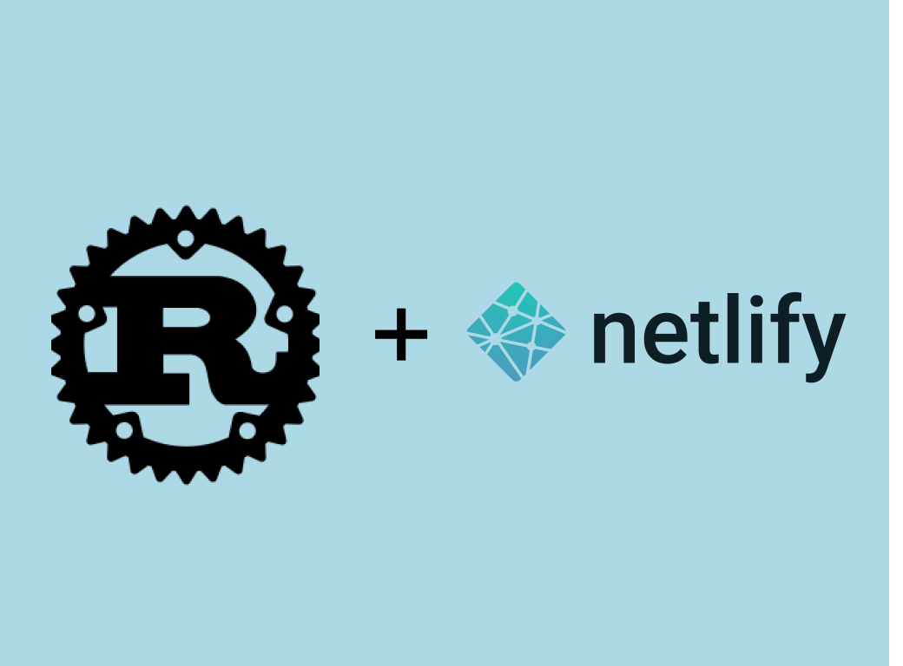

# Rust + Netlify: Creating and Deploying a Documentation Manual Easily

Rust is an amazing programming language that allows developers build efficient tools. Rust provides a tool for creating documentation or anything that requires a clean, easily navigable presentation called [mdbook](https://rust-lang.github.io/mdBook/).



Mdbook is a [static site generator](https://www.netlify.com/blog/2020/04/14/what-is-a-static-site-generator-and-3-ways-to-find-the-best-one/), it generates books from markdown files. This is interesting, because markdown is light-weight, less cumbersome to write, read and edit.

In this article, we'll explore how to create documentations with mdbook, and launch them on [Netlify](https://www.netlify.com/).

> To follow the instructions in this guide, it is expected that you have a little knowledge of how to write markdown. If you don't already know how to write markdown, this [guide](https://www.markdownguide.org/getting-started?msclkid=2b0d247bb1a311ecaa6af8aeb9988ece) is a great fit.

## Why is Documentation Neccessary

Documentation is an important part of programming. For instance, proper documentation improves user's experience when they use your tool. Programming documentation explains how a software works, including detailed instructions or steps on how to use them. Without proper documentation, user's or even other developers won't be able to utilize the product efficiently.

A proper documentation should go straight to the point, it should answer the questions of the user. Writers can achieve this by organizing documents according to type so that users can search for documents easily. Also, the addition of a search button can greatly improve user experience as they can search for "keywords" using the search button. This is exactly what mdbook provides, a search button and easily navigable book.


[Attach an Image showing arroes of search botton and navbar]

## Installing and Setting-up Mdbook

Installing mdbook is the first step to get started with generating documentation for your product. To install mdbook, you first need to have [Rust installed](https://www.rust-lang.org/tools/install) in your working environment. Now, run the command below, to install mdbook.

```rust
cargo install mdbook
```

Next, we'll create a book. You can think of a book as a documentation for a product if your firm deals with more than one product. For instance, a firm which produces a speaker, mouse and keyboard will need different documentations for each of their products. This means they'll have to create different books assuming they're using mdbook for their documentation. Run the command below to create a book.

```rust
// Replace <book_name> with the name of your firm's tool
mdbook init <book_name>
```

Now, navigate to the book you just created by running the command below:

```rust
// Replace <book_name> with the name of the book you created
cd <book_name>
```

We'll now render our book in a web browser to inspect what we've created. Run the command below to build the book and render it in your default browser.

```rust
mdbook serve --open
```

The `server` command automatically builds your book after each change, rendering it in the server while the  `--open` option opens `http://localhost:3000` in your browser so you can view your changes. If you already have `http://localhost:3000` open in your browser, you can just run the serve command without the open option.

```rust
mdbook serve
```

Now that we've generated a documentation template, we can customize it to suite our needs. We can either generate new folders/files for our documents in the `src` folder, or navigate to `src/summary.md` in the book you created. In the `summary.md` file, we can add links to our navigation bar which will generate document folders/files for our documentation. Add these directly under the `# Summary` heading in `summary.md`

```md
- [Chapter 1](Chapter1.md)
- [Chapter 2](Chapter2.md)
- [Chapter 3](Chapter3/Chapter3.1.md)
    - [Chapter 3](Chapter3/Chapter3.2.md)
```

THe code above will create a `Chapter1.md`, a `Chapter2.md` file, a `Chapter3` and a subset `Chapter3` folder. Now, you can customize the book to suite your needs. For instance, you can add a contact page to your webpage. Once you're satisfied with the changes you've made, we can howt this for free with [Netlify](https://www.netlify.com/?msclkid=5c5431e8b19711ec948768e2addc0a7d). To do this, we'll first have to push the book we generated to [Github](https://github.com/).

## Pushing Changes to Github

GitHub is a version control repository hosting service, which provides access control and several collaboration features. Here, we'll use Github for storing the generated codes from our book. To do this, initialize the book you created with git by running this:

```
git init
```

Next, click on the new repository button on Github to create a new repository for the Rust book.


Add a repository name and description for the repository and click the **create repository** button.


In your terminal, run the commands below to `add` and `commit` the changes in your book.

```
git add .
git commit -m "first commit"
```

Now, add remote origin. Replace `<URL>` with the link to your repository. 

```
// Replace `<URL>` with the link to your repository. For instance, https://github.com/hannydevelop/me.git
git remote add origin <URL>
```
Then push your changes to the Github repository you just created.

```
git push -u origin main
```

## Hosting book with Netlify

We can host our book using Github pages. However, Netlify allows users to deploy sites painlessly with modern tools. For instance, Netlify offers continuous deployment and deploy previews. Therefore, in this article, we'll be deploying our book to Netlify. You can follow this guide on how to [setup a Netlify account](https://serverless-stack.com/chapters/setting-up-your-project-on-netlify.html?msclkid=02770c9fb19e11ec873274b51a73c40d).

In your Netlify dashboard, click on the **Add new site** button, choose the **Import an existing project** button. 


You'll be directed to the page below, click on the **Github** button, since your project is hosted on Github.


Pick the repository holding your book. Next, you'll need to add some settings for our book. Add the following in the build command section.

```
curl -L https://github.com/rust-lang/mdBook/releases/download/v0.3.3/mdbook-v0.3.3-x86_64-unknown-linux-gnu.tar.gz | tar xvz && ./mdbook build 
```

This command is necessary, since Netlify currently doesn't [fully support Rust](https://github.com/netlify/build-image/pull/320). Next, add `book` as the publish directory. Then, hit the **Deploy site** button.


You can see that your static site has been deployed in your dashboard.


## Conclusion
In this article, we have explored static site generation with mdbook. We've also discussed how to deploy your mdbook to Netlify. In our next series, we'll explore how to customize our book into a personal blog. Checkout this space as I walk you through programming with Rust.
